# Launching My Cryptocurrency on Solana Blockchain : A Decentralized Finance (DeFi) Project

## ***Prerequisites***

<br/>

1. An **IDE** of your choice, which is **Visual Studio Code** in my case. You can download it from this [link](https://code.visualstudio.com/download).
   
2. **Solana** on your computer. You can get the clear steps to download it from this [link](https://docs.solana.com/cli/install-solana-cli-tools#use-solanas-install-tool).

<br/>

## ***Setting up Solana on a Windows machine***

<br/>

### ***Setup WSL***

<br/>

To get started with **WSL (Windows Subsystem for Linux)**, open up cmd.exe in Admin mode to start and then you are going to run this command

```
wsl --install

```
Further information on WSL installation can be found on the following link: [Install WSL](https://docs.microsoft.com/en-us/windows/wsl/install)

<br/>

### ***Installing Node.js***

<br/>

Feel free to just follow [this](https://docs.microsoft.com/en-us/windows/dev-environment/javascript/nodejs-on-wsl) guide on how to get this setup on WSL, but essentially our flow is going to look like this:

```
// Install Curl
sudo apt-get install curl

// Install NVM
curl -o- https://raw.githubusercontent.com/nvm-sh/nvm/v0.38.0/install.sh | bash

// Restart Ubuntu Terminal

// Test if nvm exists - this will return "nvm" and not a version number if working correctly!
command -v nvm

// Install the latest version of Node.js
nvm install --lts

```
<br/>

### **Install Rust**

<br/>

To install Rust we use :

```
curl --proto '=https' --tlsv1.2 https://sh.rustup.rs -sSf | sh

```
Once we're done, verify by doing:

```
rustup --version

```
Then, make sure the rust compiler is installed:

```
rustc --version

```
Last, to make sure Cargo is working as well(**Cargo** is the rust package manager)

```
cargo --version

```
<br/>

### **Install Solana**

<br/>

1. Open a Command Prompt (`cmd.exe`) as an Administrator
2. Copy and paste the following command, then press Enter to download the Solana installer into a temporary directory:

   ```
   curl https://release.solana.com/v1.10.8/solana-install-init-x86_64-pc-windows-msvc.exe --output C:\solana-install-tmp\solana-install-init.exe --create-dirs

   ```
3. Copy and paste the following command, then press Enter to install the latest version of Solana. If you see a security pop-up by your system, please select to allow the program to run

   ```
   C:\solana-install-tmp\solana-install-init.exe v1.10.8

   ```

4. When the installer is finished, press Enter

5. Close the command prompt window and re-open a new command prompt window as a normal user. Search for "Command Prompt" in the search bar, then left click on the Command Prompt app icon, no need to run as Administrator.

6. Confirm you have the desired version of solana installed by entering:

   ```
   solana --version

   ```

7. After a successful install, `solana-install update` may be used to easily update the Solana software to a newer version at any time

8. Next thing you'll want to do is run these two commands separately:

   ```
   solana config set --url localhost
   solana config get

   ```
   This will output something like

   ```
   Config File: /Users/flynn/.config/solana/cli/config.yml
   RPC URL: http://localhost:8899
   WebSocket URL: ws://localhost:8900/ (computed)
   Keypair Path: /Users/flynn/.config/solana/id.json
   Commitment: confirmed

   ```
This means that Solana is set up to talk to our local network! When developing programs, we're going to be working w/ our local Solana network so we can quickly test stuff on our computer.

The last thing to test is we want to make sure we can get a local Solana node running. Basically, remember how we said that the Solana chain is run by "validators"? Well — we can actually set up a validator on our computer to test our programs with.

```
solana-test-validator

```
This may take a bit to get started but once it's going you should see something like this


We're now running a local validator. Now, go ahead and `CONTROL + C` to stop the validator. We're never going to actually use solana-test-validator manually ourselves again. 

<br/>

## ***Demystifying Jargons!!!***

<br/>

> **Token** or a **Coin**???

***Tokens***: Tokens are an abstraction that represents ownership. Ownership implies certain privileges such as the right to use or sell an item like a vehicle or a house. A token is any digital asset created on the blockchain. It is usually issued or minted on another blockchain, often existing alongside several other tokens that belong to different projects.

<br/>

***Coin***: A coin is a cryptocurrency that runs on its blockchain. It is also referred to as the **“native token”** of the blockchain and often serves as a way for projects to pay transaction fees while building out their applications on the same blockchain.

* **Ether (ETH)** is a **coin** and the **‘native token’** of the **Ethereum** blockchain.
<br/>

* For example, the **Ethereum** blockchain allows developers to create their own **tokens** on top of the network using a standard called [**ERC-20**](https://ethereum.org/en/developers/docs/standards/tokens/erc-20/). The **ERC-20** standard is used when creating a **fungible, or mutually interchangeable** token. Any **token** created on **Ethereum** might be referred to as a **‘token’** and not a **‘coin’**. **Ether (ETH)** is the **Ethereum** network’s native **cryptocurrency**.
<br/>

* Examples of **ERC-20** **tokens** on **Ethereum** include **Basic Attention Token (BAT)**, **Chainlink (LINK)**, **Tether (USDT)**, **Wrapped Bitcoin (WBTC)**, **Dai (DAI)**, **Compound (COMP)**, and many others.
<br/>

* **Tokens** can eventually become **coins** when the project develops its own blockchain and migrate their tokens to the new blockchain as a **coin**. Successful migration cases include **Binance Coin (BNB)**, **Tron (TRX)**, **Zilliqa (ZIL)** which previously existed as tokens on the **Ethereum** blockchain.

<br/>
   
## Installing Solana Programming Library (SPL)

1. Check whether **solana** is installed on my system:

   ```
   $ solana --version

   ```

2. Installing **SPL** command line interface (**cli**), which is a **RUST** package, for interacting with **SPL token program** that I will be using for creating my token :
 
   ```
   $ cargo install spl-token-cli
   
   ```

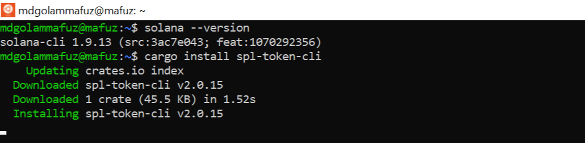
<br/>

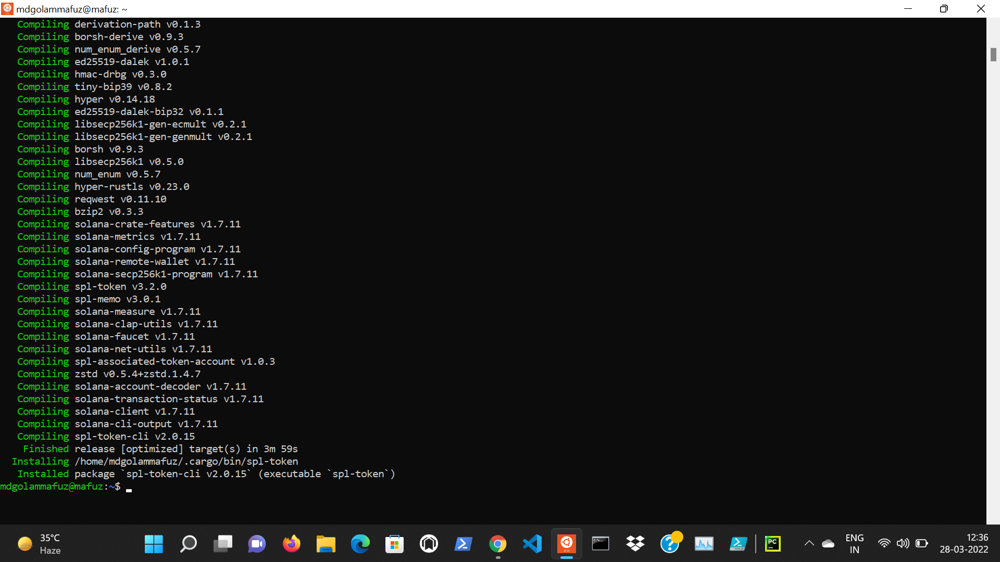

<br/>

## ***Creating my Wallet and checking on Solana Explorer***

<br/>

To **transact** money on the **blockchain**, we need to use a **crypto-wallet** which allows us to store, send and receive **crypto-assets** like **cryptocurrency** or **tokens**.

<br/>

1. Setting up a new **wallet**:
   
   ```
   $ solana-keygen new

   $ solana-keygen new --force

   ```

2. Checking my **publickey**:

   A blockchain has a unique identifier called **publickey** or **pubkey**, which is a cryptographic string of **alphanumeric** characters.
   
   ```
   $ solana-keygen pubkey

   ```

3. Checking my **balance**:  
  
   ```
   $ solana balance --url devnet

   ```

4. Checking my balance on explorer.solana.com:

   Choose ***devnet*** and pasted the ***publickey*** onto the searchbox.
   

5. **Airdropping** solana currency in my **wallet**
 
   ```
   $ solana airdrop 2 <pubkey> --url devnet

   ```


<br/>

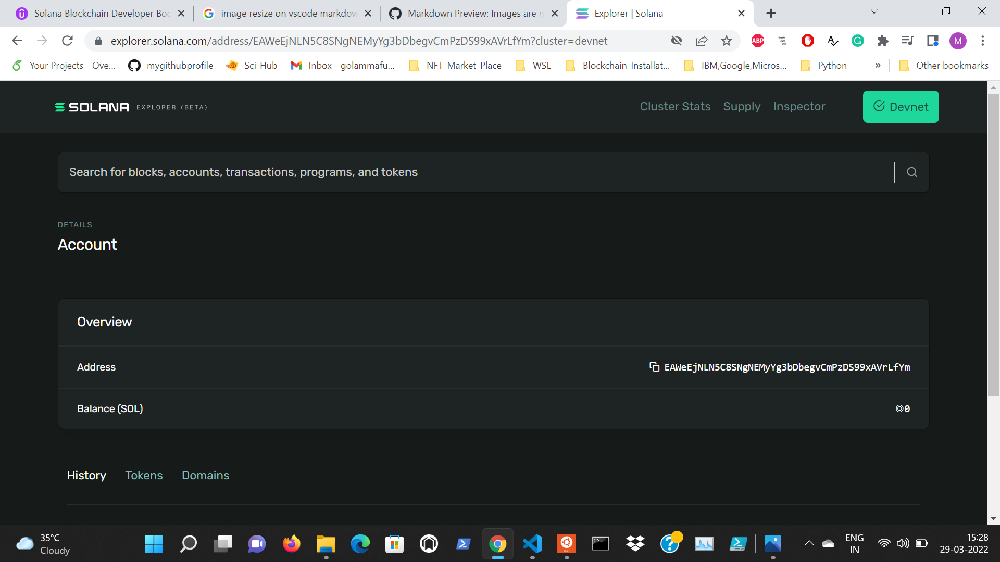
<br/>

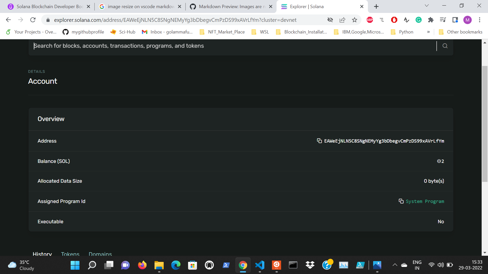

<br/>

## ***Creating a Token with SPL library***   

<br/>

> Difference between **Creating** and **Minting** a **Token** :

* ***Creating a Token*** is like creating the structure of the token.
<br/>

* ***Minting a Token*** is like actually making copies of that specific token.

* To **create a token** using SPL:

   ```
   $ spl-token create-token --url devnet

   ```  
When a token goes on the soalna blockchain, they are given a **unique address**. In my case, the **unique Token address** is: **3FWpeHmnKE2Ztc8L9oVtnJSGmtjUAsLdLLb7qJKzpEsf**. This actually implies that I have created my own **cryptocurrency** on **Solana Blockchain!**

<br>

## ***Minting a Token***

<br/>

**Accounts** are like files that allow us to store data on blockchain. In a solana wallet, to collect a particular type of **token** we need to have an **account** in our **wallet**, that is specific for that **token** and that can hold that specific **token**. A **wallet** can have multiple **accounts** and each **account** is used to transact one type of **token**.

<br/>

1. To **create an account** that can hold the **tokens** I have created:

   ```
   $ spl-token create-account 3FWpeHmnKE2Ztc8L9oVtnJSGmtjUAsLdLLb7qJKzpEsf --url devnet

   ```

   The id, **FcXu9ypeBZxQgQMMcCk9XiP1u4PZZDPUYkcrwYBExXv8**, represents the **address** of an **empty token account** in my **wallet**.

2. To check the **balance** of my **tokens**, that is the **number of tokens** I have in my newly created **account**:
 
   ```
   $ ***spl-token balance 3FWpeHmnKE2Ztc8L9oVtnJSGmtjUAsLdLLb7qJKzpEsf  --url devnet***
   
   ```

   The process of **making tokens** is called **Minting**.


4. To **mint** 10000 **tokens** for my **account**:
   
   ```
   $ spl-token mint 3FWpeHmnKE2Ztc8L9oVtnJSGmtjUAsLdLLb7qJKzpEsf 10000 --url devnet

   ```

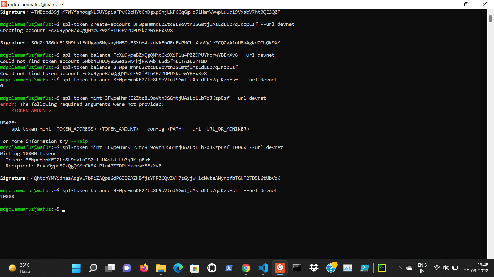

<br/>

## ***Limiting the total supply and Burning my token***

1. To view the **circulating supply** of my **tokens**:  
   
   ```
   $ ***spl-token supply 3FWpeHmnKE2Ztc8L9oVtnJSGmtjUAsLdLLb7qJKzpEsf  --url devnet***
   
   ```

2. To **disable** my **minting authoirty** and never enable it back:
   
   ```
   $ spl-token authorize 3FWpeHmnKE2Ztc8L9oVtnJSGmtjUAsLdLLb7qJKzpEsf mint --disable  --url devnet

   ```


3. Now, if I try to **mint further tokens**, I should get the **error**:
   
   ```
   **RPC response error -32002: Transaction simulation failed: Error processing Instruction 0: custom program error: 0x5 [5 log messages]**

   ```

4. To **burn** my tokens, which means to remove tokens that I own out of circulations so that they can never be used again :
   
   ```
   $ spl-token burn FcXu9ypeBZxQgQMMcCk9XiP1u4PZZDPUYkcrwYBExXv8 1000 --url devnet

   ```
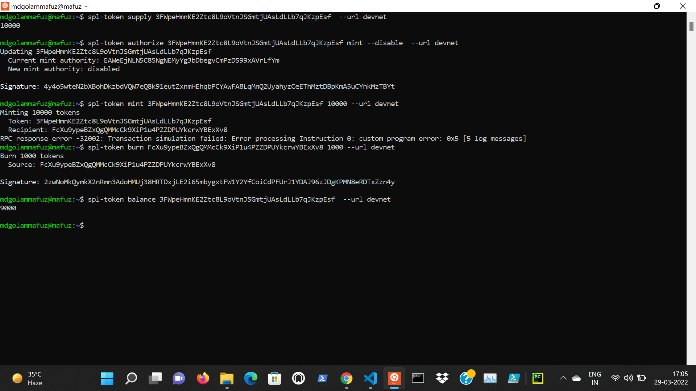

<br/>

## ***Sending my tokens to my friend holding a wallet on SOLFARE***

<br/>

**SOLFARE** allows us to transact on the Soalana Blockchain. **SOL** is the native token of the Solana Blockchain. Similar to how **ETH** is to **Ethereum blockchain**. SOL is used to interact and transact on the Solana blockchain. However, we can't send SPL tokens to SOL address like we do with ERC20 tokens because each **SPL token** on Solana blockchain will have their own address. We have to add each **SPL token** separately before we can receive them in any wallet.

<br/>

1. For the sake of demonstration, let me act as my friend. Let me add an account for my token in my friend's SOLFARE wallet by clicking **+ADD NEW ASSET**. The **publickey** of my friend's wallet is **65Z5XFsqo7iMEFBYJcKR1SZMdWAoiDRrN9M7RB5Hvvfe**

2. Change the network from **mainnet** to **devnet**.

3. To send my 500 tokens to my friend's wallet:
   
   ```
   $ spl-token transfer 3FWpeHmnKE2Ztc8L9oVtnJSGmtjUAsLdLLb7qJKzpEsf 500 65Z5XFsqo7iMEFBYJcKR1SZMdWAoiDRrN9M7RB5Hvvfe --url devnet --allow-unfunded-recipient --fund-recipient

   ```

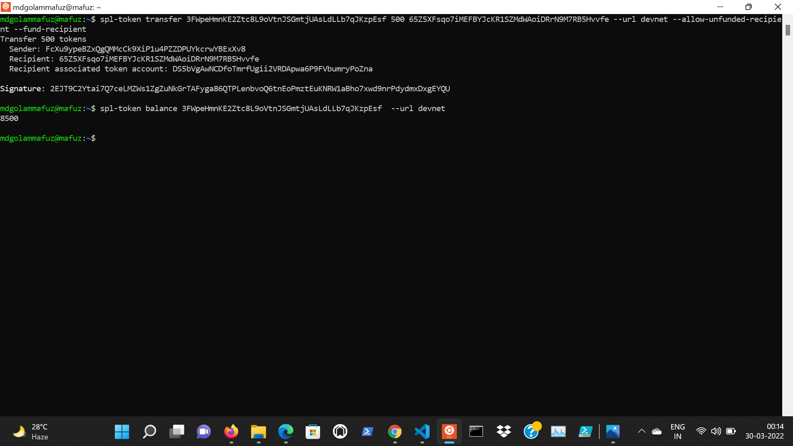
<br/>

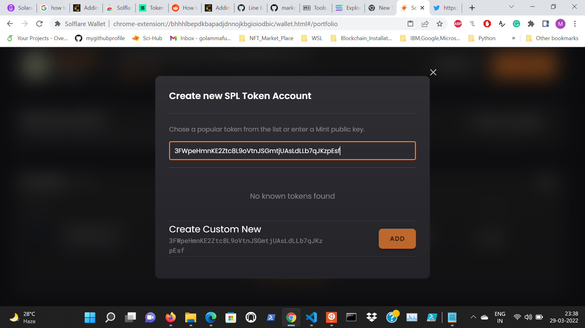
<br/>

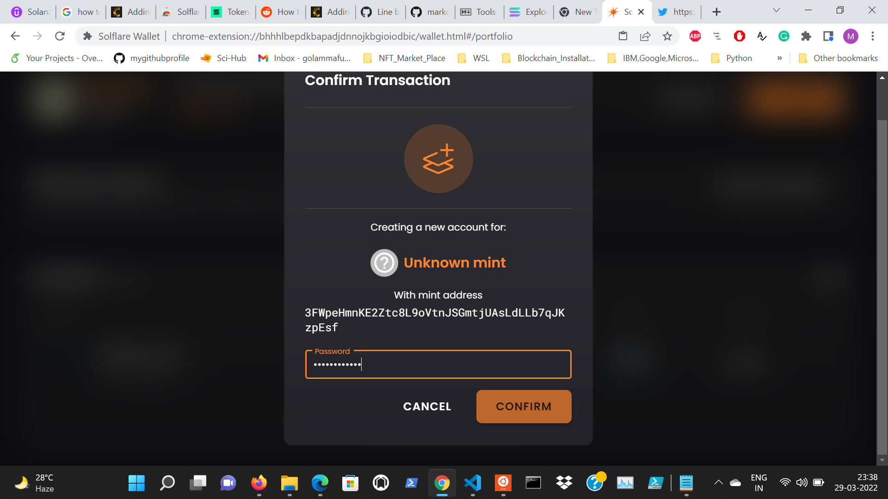
<br/>

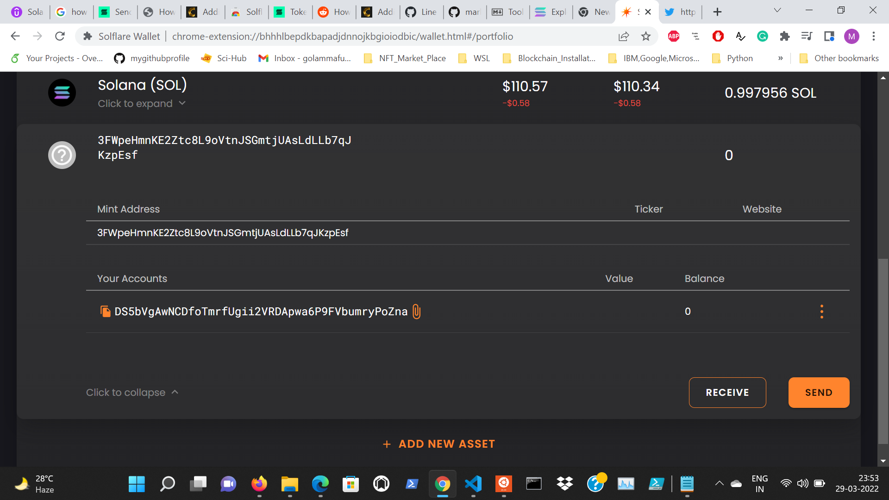
<br/>
   
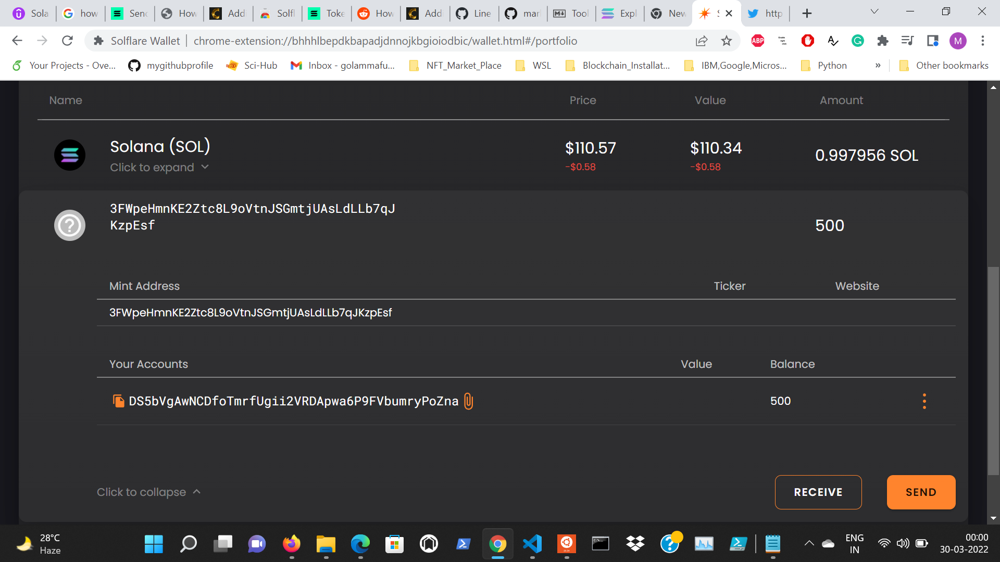
   
<br/>
    
## References
    
1. Bitcoin and cryptocurrency technologies : A Comprehensive Introduction
 ARVIND NARAYANAN, JOSEPH BONNEAU, EDWARD FELTEN, ANDREW MILLER, AND STEVEN GOLDFEDER
 PRINCETON UNIVERSITY PRESS 
    <br/>
    
2. Hands-On Smart Contract Development with Solidity and Ethereum by Kevin Solorio, Randall Kanna, and
David H. Hoover (O’Reilly). Copyright 2020 Kevin Solorio, Randall Kanna, and
David H. Hoover, 978-1-492-04526-7.
    <br/>
    
3. [LearnWithArjun/solana-env-setup](https://github.com/LearnWithArjun/solana-env-setup)
    <br/>
    
4. [Solana Blockchain Developer Bootcamp with Rust + JavaScript](https://www.udemy.com/course/solana-developer/)
