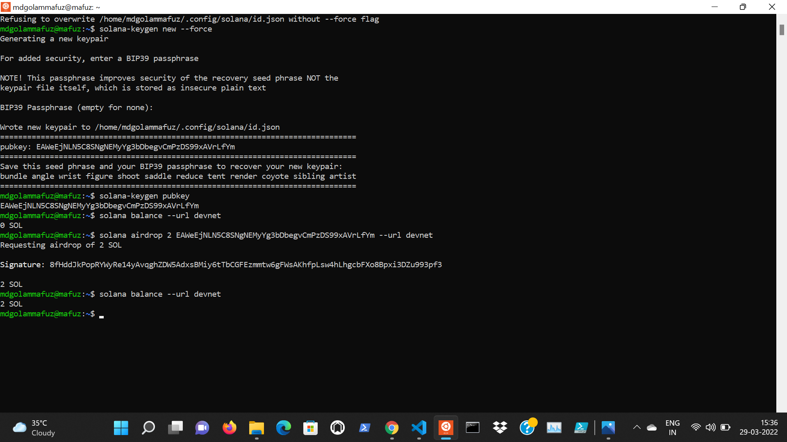
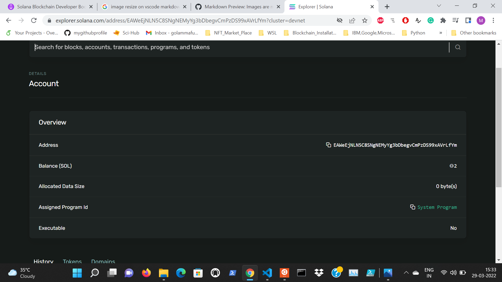

# Launching My Own Cryptocurrency on Solana Blockchain : A Decentralized Finance (DeFi) Project

## Installing Solana Programming Library (SPL)

1. Checking whether **solana** is installed on my system :
    
   
   $ ***solana --version***
    

2. Installing **SPL** command line interface (**cli**), which is a **RUST** package, for interacting with **SPL token program** that I will be using for creating my token :
    

   $ ***cargo install spl-token-cli***
    

   
    
   
   

## Creating my own wallet and checking on Solana Explorer

To **transact** money on the **blockchain**, we need to use a **crypto-wallet** which allows us to store, send and receive **crypto-assets** like **cryptocurrency** or **tokens**.
 

1. Setting up a new **wallet**:
    

   $ ***solana-keygen new***

   $ ***solana-keygen new --force***
 
1. Checking my **publickey** : 
A blockchain has a unique identifier called **publickey** or **pubkey**, which is a cryptographic string of **alphanumeric** characters.
 

   $ ***solana-keygen pubkey***
 

1. Checking my **balance**:  
 

   $ ***solana balance --url devnet***
 

1. Checking my balance on explorer.solana.com:
 

   I chose ***devnet*** and pasted the ***publickey*** on the searchbox.
 

5. **Airdropping solana currency** in my **wallet**
 

   $ ***solana airdrop 2 <pubkey> --url devnet***
 

 

 

## Creating a Token with SPL library
 

> Difference between **Creating** and **Minting** a **Token** :
* ***Creating a Token*** is like creating the structure of the token.
* ***Minting a Token*** is like actually making copies of that specific token.
 
1. To **create a token** using SPL:
 

   $ ***spl-token create-token --url devnet***

 

When a token goes on the soalna blockchain they are given a **unique address**. In my case, the **unique Token address** is: **3FWpeHmnKE2Ztc8L9oVtnJSGmtjUAsLdLLb7qJKzpEsf**. This actually implies that I have created my own **cryptocurrency** on **Solana Blockchain!**

## Minting a Token

**Accounts** are like files that allow us to store data on blockchain. In a solana wallet, to collect a particular type of **token** we need to have an **account** in our **wallet**, that is specific for that **token** and that can hold that specific **token**. A **wallet** can have multiple **accounts** and each **account** is used to transact one type of **token**.
 

1. To **create an account** that can hold the **tokens** I have created:
  

   $ ***spl-token create-account 3FWpeHmnKE2Ztc8L9oVtnJSGmtjUAsLdLLb7qJKzpEsf --url devnet***
 

   The id, **FcXu9ypeBZxQgQMMcCk9XiP1u4PZZDPUYkcrwYBExXv8**
, represents the **address** of an **empty token account** in my **wallet**.
 
2. To check the **balance** of my **tokens**, that is the **number of tokens** I have in my newly created **account** :
    

   $ ***spl-token balance 3FWpeHmnKE2Ztc8L9oVtnJSGmtjUAsLdLLb7qJKzpEsf  --url devnet***
 

   The process of **making tokens** is called **Minting**.
 

3. To **mint** 10000 **tokens** for my **account**:
 

   $ ***spl-token mint 3FWpeHmnKE2Ztc8L9oVtnJSGmtjUAsLdLLb7qJKzpEsf 10000 --url devnet***

## Limiting the total supply and burning my token

1. To view the **circulating supply** of my **tokens**:  
 

   $ ***spl-token supply 3FWpeHmnKE2Ztc8L9oVtnJSGmtjUAsLdLLb7qJKzpEsf  --url devnet***
 

2. To **disable** my **minting authoirty** and never enable it back:
 

   $ ***spl-token authorize 3FWpeHmnKE2Ztc8L9oVtnJSGmtjUAsLdLLb7qJKzpEsf mint --disable  --url devnet***
 

4. Now, if I try to **mint further tokens**, I should get an **error** like the following:
    

   **RPC response error -32002: Transaction simulation failed: Error processing Instruction 0: custom program error: 0x5 [5 log messages]**

 

5. To **burn** my tokens, which means to remove tokens that I own out of circulations so that they can never be used again :
    

   ***$ spl-token burn FcXu9ypeBZxQgQMMcCk9XiP1u4PZZDPUYkcrwYBExXv8 1000 --url devnet***

## Sending my tokens to my friend holding a wallet on SOLFARE

**SOLFARE** allows us to transact on the Soalana Blockchain. **SOL** is the native token of the Solana Blockchain. Similar to how **ETH** is to **Ethereum blockchain**. SOL is used to interact and transact on the Solana blockchain. However, we can't send SPL tokens to SOL address like we do with ERC20 tokens because each **SPL token** on Solana blockchain will have their own address. We have to add each **SPL token** separately before we can receive them in any wallet.

1. For the sake of demonstration, let me act as my friend. Let me add an account for my token in my friend's SOLFARE wallet by clicking **+ADD NEW ASSET**. The **publickey** of my friend's wallet is **65Z5XFsqo7iMEFBYJcKR1SZMdWAoiDRrN9M7RB5Hvvfe**
 

1. Change the network from **mainnet** to **devnet**.
 

3. To send my 500 tokens to my friend's wallet:
 
   
   $  ***spl-token transfer 3FWpeHmnKE2Ztc8L9oVtnJSGmtjUAsLdLLb7qJKzpEsf 500 65Z5XFsqo7iMEFBYJcKR1SZMdWAoiDRrN9M7RB5Hvvfe --url devnet --allow-unfunded-recipient --fund-recipient***
